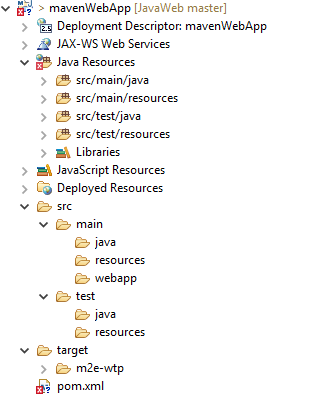
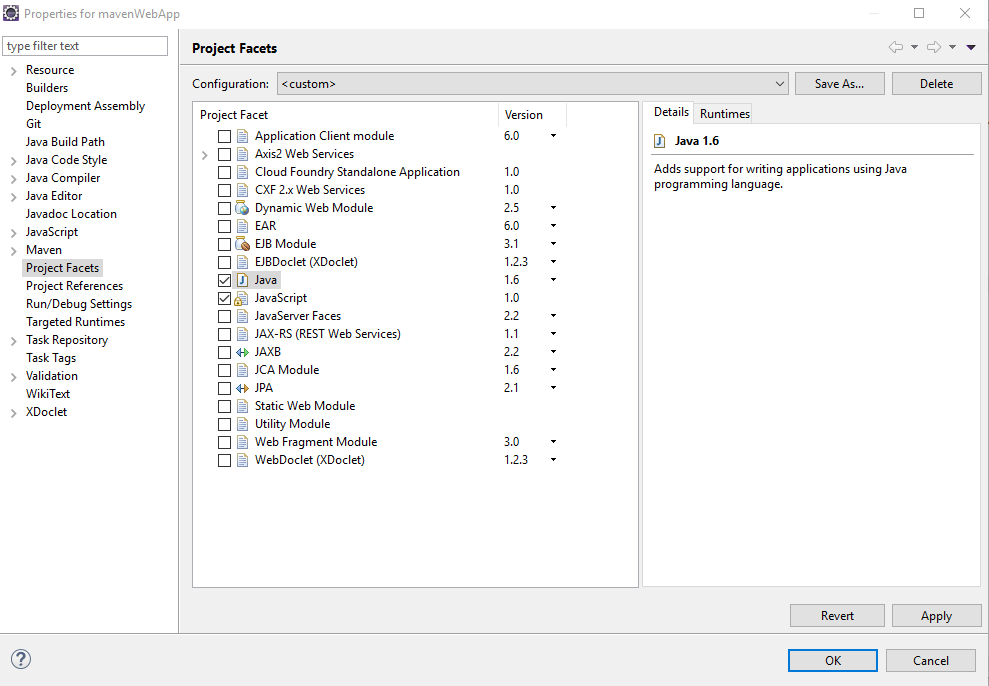
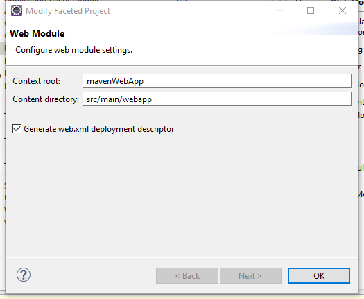
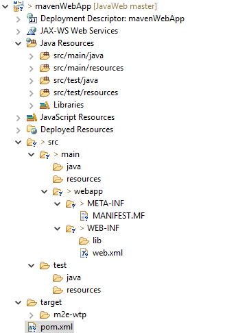

# 使用Eclipse创建MAVEN WEB项目
参考网络链接：
[使用eclipse插件创建一个web project](http://blog.csdn.net/chuyuqing/article/details/28879477)
[用Maven创建第一个web项目](http://blog.csdn.net/xybelieve1990/article/details/52043127)
## 创建Maven项目
基于Eclipse Version: Neon.3 Release (4.6.3)  
1. 选择新建Maven project，并勾选Create a simple project选项。
2. `Configure project`窗口中填写`Group Id`和`Artifact Id`并选择`Packaging`为`war`。
3. 点击完成创建Maven项目。
4. 生成的项目如下图所示。

5. 当前项目中存在错误，并且显示为2.5版本的Web module.为解决该错误，需要在项目右键选择`Properties`并切换到`Project Facets`取消`Dynamic Web Services`选项后点击OK。  

6. 再次打开项目`properties`然后选择`Dynamic Web Services`选项并且将版本选择为`3.1`。由于3.1版本需要至少Java1.7以上版本，因此将`Java`版本选择为`1.8`。		

7. 点击下面的黄色`Futher Configuration available..`提示，在弹出的`Web Module`窗口中修改`Content Directory`目录指向自动生成的`src/main/webapp`目录，并勾选`Generate web.xml deplopyment descriptor`。点击OK关闭窗口然后再点击OK关闭Properties应用修改。  

8. 完成后项目Maven Web项目创建成功，如下图所示

